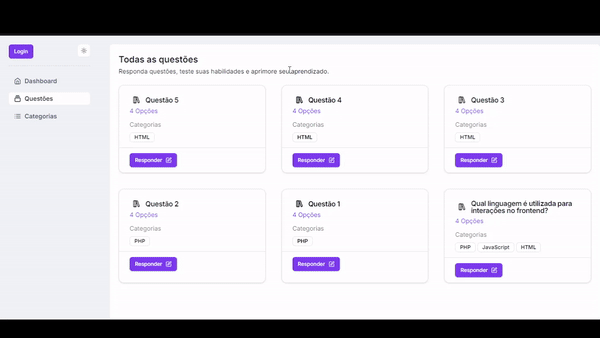

# 🚀 Projeto de Questões de Tecnologia

  

## 📋 Índice

-   [Sobre](#sobre)
-   [Tecnologias](#tecnologias)
-   [Funcionalidades](#funcionalidades)
-   [Instalação](#instalação)

## 📝 Sobre

O **Projeto de Questões de Tecnologia** foi desenvolvido para ajudar usuários a praticar e testar seus conhecimentos em diferentes áreas da tecnologia, como programação, redes, banco de dados, entre outras. Além disso, ele oferece gráficos detalhados para que os usuários possam acompanhar sua evolução e identificar áreas para melhoria.

## 🛠️ Tecnologias

Este projeto utiliza as seguintes tecnologias e ferramentas:

-   **[Typescript]**
-   **[React.js]** - Para construção da interface de usuário
-   **[Chart.js]** - Para a criação dos gráficos de desempenho
-   **[shadcn/ui]** - Biblioteca de componentes
-   **[API REST]** - Integração com os dados de questões e performance
-   **[Node.js]** e **Fastify**
-   **[MongoDB]** - Banco de dados

## ✨ Funcionalidades

-   📋 **Banco de Questões**: Permite aos usuários responderem questões de múltipla escolha em várias áreas de tecnologia.
-   📊 **Gráficos de Desempenho**: Exibe gráficos de performance, permitindo que os usuários acompanhem seu progresso ao longo do tempo.
-   🔍 **Feedback Imediato**: Os usuários recebem feedback imediato após responder uma questão.
-   🏆 **Rankings e Desafios**: Comparação de performance entre usuários e criação de desafios para incentivar a competição saudável (Em desenvolvimento).
